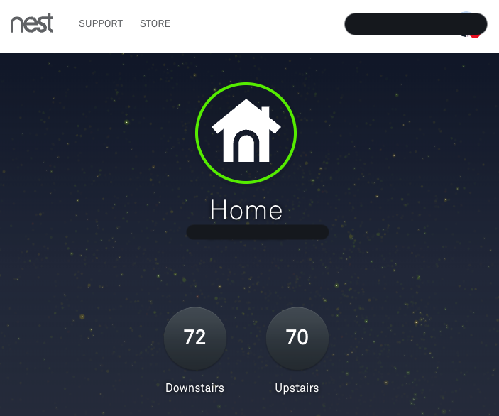
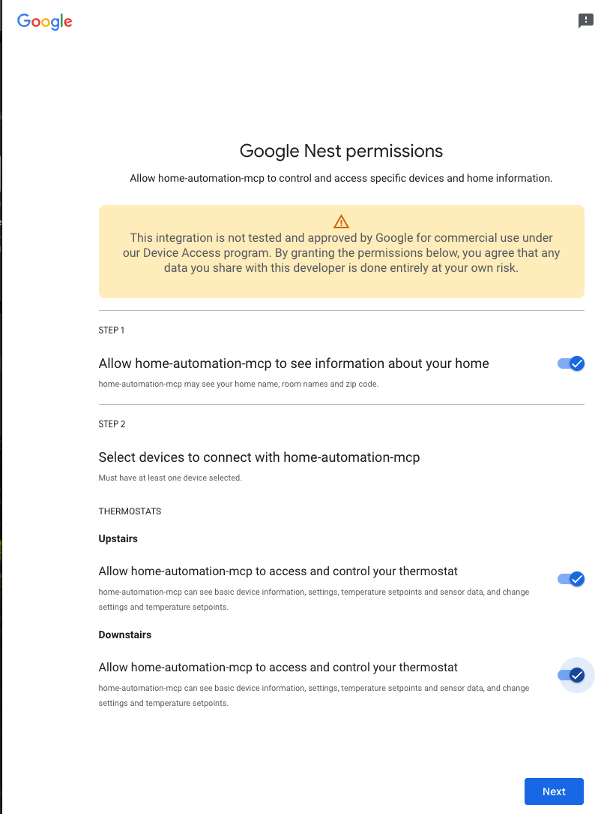
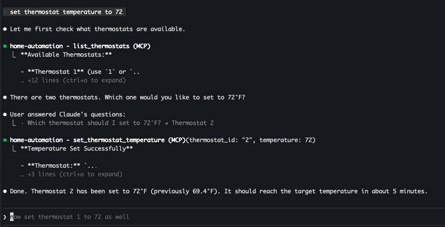

# Home Automation MCP Server

An MCP server that lets you control your Google Nest thermostats and check weather using natural language through Claude Desktop, Claude Code, or Gemini CLI.



## What You Can Do

- **"List my thermostats"** — See all your Nest thermostats with current temperatures
- **"Set thermostat to 72"** — Change the target temperature
- **"What's the weather in San Francisco?"** — Get current weather conditions
- **"5-day forecast for New York"** — Get weather forecasts
- **"Any weather alerts near me?"** — Check for active weather alerts

## Prerequisites

- Python 3.11+
- [uv](https://docs.astral.sh/uv/) package manager
- A Nest thermostat linked to your Google account via the Google Home app
- An [OpenWeatherMap API key](https://openweathermap.org/api) (free tier works)

## Setup

### 1. Install dependencies

```bash
cd home-automation-mcp
uv sync --extra dev
```

### 2. Set up Google Device Access (one-time)

This is required to control your real Nest thermostat. Google charges a **one-time $5 fee**.

1. **Register** at the [Google Device Access Console](https://console.nest.google.com/device-access/). Accept terms, pay $5, and create a project. Note your **Project ID**.

2. **Enable the SDM API** in your GCP project:

   ```bash
   gcloud services enable smartdevicemanagement.googleapis.com --project=YOUR_GCP_PROJECT
   ```

3. **Create OAuth credentials** in [GCP Console → APIs & Services → Credentials](https://console.cloud.google.com/apis/credentials):
   - Set up an **OAuth consent screen** (External type, add yourself as a test user)
   - Create an **OAuth client ID** (Web application type)
   - Add redirect URI: `http://localhost:8090/auth/callback`
   - Save your **Client ID** and **Client Secret**

4. **Link OAuth client to Device Access** — Back in the [Device Access Console](https://console.nest.google.com/device-access/project-list), select your project → OAuth Client ID → Add your Client ID from step 3.

### 3. Configure environment

```bash
cp .env.example .env
```

Fill in your `.env`:

| Variable | Where to get it |
| --- | --- |
| `GOOGLE_PROJECT_ID` | Device Access Console (step 2.1) |
| `GOOGLE_CLIENT_ID` | GCP OAuth credentials (step 2.3) |
| `GOOGLE_CLIENT_SECRET` | GCP OAuth credentials (step 2.3) |
| `WEATHER_API_KEY` | [OpenWeatherMap](https://openweathermap.org/api) — sign up for free |
| `USE_REAL_NEST_API` | `true` for real Nest, `false` for dummy API |

### 4. Authenticate with Google Nest

```bash
PYTHONPATH=$PWD uv run python scripts/nest_oauth.py
```

Your browser will open. Allow access to your Nest devices and select all thermostats you want to control.



Tokens are saved to `.env` automatically.

## Connecting to Your MCP Client

### Claude Code

From the `home-automation-mcp` directory:

```bash
claude mcp add home-automation -s user -- env USE_REAL_NEST_API=true PYTHONPATH=$PWD uv run python -m src.server
```

Restart Claude Code, then ask something like "set thermostat temperature to 72":



### Claude Desktop

Add to `~/Library/Application Support/Claude/claude_desktop_config.json`:

```json
{
  "mcpServers": {
    "home-automation": {
      "command": "uv",
      "args": ["run", "python", "-m", "src.server"],
      "cwd": "/path/to/home-automation-mcp",
      "env": {
        "PYTHONPATH": "/path/to/home-automation-mcp",
        "USE_REAL_NEST_API": "true"
      }
    }
  }
}
```

Replace `/path/to/home-automation-mcp` with the actual path. Restart Claude Desktop.

### Testing with Dummy API (no Nest required)

If you want to try it without a real Nest thermostat, start the dummy API:

```bash
cd dummy_nest_api
uv run functions-framework --target=thermostat_handler --port=8081 --debug
```

Then connect your MCP client with `USE_REAL_NEST_API=false`. The dummy API returns 3 mock thermostats.

## Available Tools

### Thermostat

| Tool | Description |
| --- | --- |
| `list_thermostats` | List all thermostats with current/target temperatures |
| `get_thermostat_status` | Detailed status of a specific thermostat |
| `set_thermostat_temperature` | Set target temperature in Fahrenheit or Celsius |
| `get_thermostat_history` | Temperature history (dummy API only) |

### Weather

| Tool | Description |
| --- | --- |
| `get_current_weather` | Current conditions for a city |
| `get_weather_forecast` | 1-5 day forecast with 3-hour intervals |
| `get_weather_alerts` | Active weather alerts for a lat/lon coordinate |

## Troubleshooting

### "Invalid grant" or token refresh errors

Your OAuth tokens have expired. Re-run the auth script:

```bash
PYTHONPATH=$PWD uv run python scripts/nest_oauth.py
```

### No thermostats found

- Make sure your Nest thermostat is linked in the Google Home app
- Verify you selected the thermostat during the OAuth consent step
- Check that your OAuth client is linked in the Device Access Console

### Weather tools not working

- Verify `WEATHER_API_KEY` is set in `.env`
- The free OpenWeatherMap tier supports current weather and forecasts
- Weather alerts require the OneCall API (paid tier)

### Commands are slow

The real Google Nest API can take 5-30 seconds to respond. This is normal — Google rate-limits API calls to protect devices.

## Cost

| Item | Cost |
| --- | --- |
| Google Device Access registration | $5 one-time |
| Google SDM API calls | Free (within quotas) |
| OpenWeatherMap (free tier) | Free |

## Disclaimer

This is a personal hobby project. It is **not** an official Google product and is not affiliated with, endorsed by, or supported by Google in any way. Google, Nest, and related trademarks are property of Google LLC.

This software is provided as-is with no warranties. You are responsible for your own security and safety when using this project, including safeguarding API credentials, securing OAuth tokens, and evaluating risks of controlling devices programmatically. Do your own due diligence before using this in any environment.

## License

Apache-2.0
